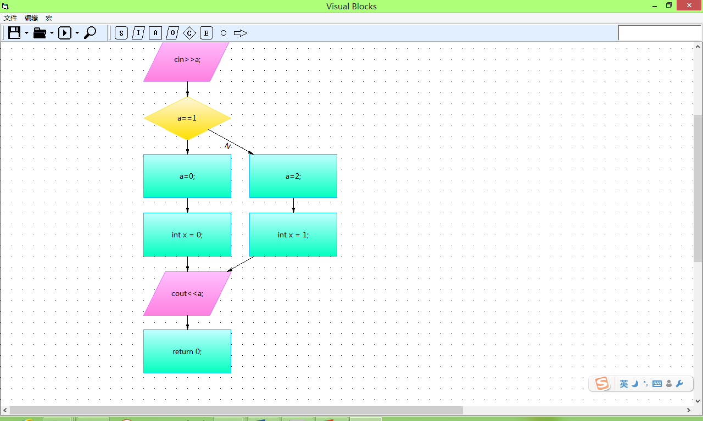
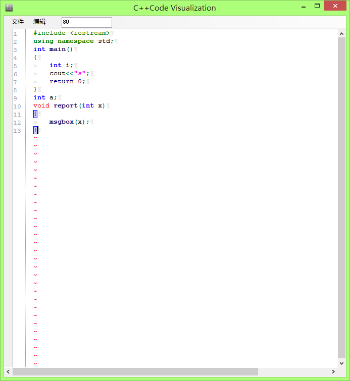
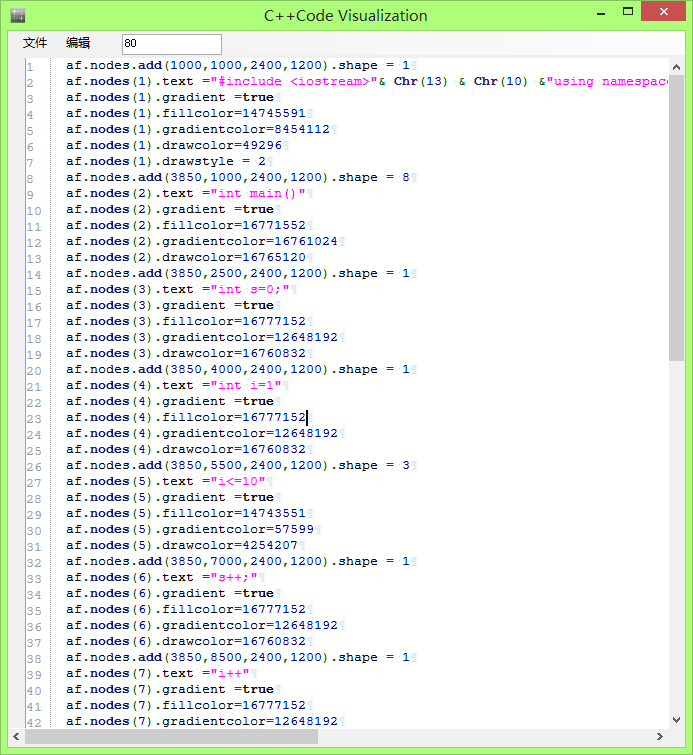

## Visual Blocks

Visual Blocks is a combination of two sub projects which both provide GUI that let users create Code Flowcharts and convert to code or convert codes (c++) to Code Flowcharts.

`\code2vbm` has a lot of Demo.

Zihao Jin @jinzihao now as @jzh14 and I, did this project in 2013 in high school's computer research study and get awarded first prize in school and a corresponding contest in Beijing.

So the demo ppt was in Chinese.

More Demos in [code2vbm folder](./code2vbm/)

Demo of c++ to flowchart in VisualBlock's GUI

C++ Editor of the convertor interface:

Generated VB macros:

